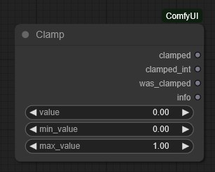
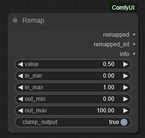
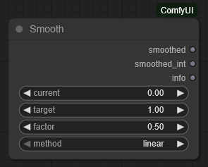
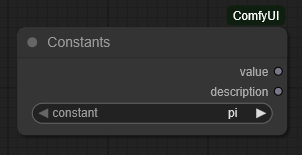

# ComfyUI Media Suite

Professional media processing nodes for ComfyUI that provide comprehensive tools for image and video manipulation, color analysis, and workflow automation.

## Overview

ComfyUI Media Suite extends ComfyUI with professional-grade nodes designed for complex media processing workflows. Whether you're batch processing images, color grading videos, or building automated pipelines, these nodes provide the flexibility and control needed for production work.

## Installation

1. Navigate to your ComfyUI custom nodes directory:
```bash
cd ComfyUI/custom_nodes
```

2. Clone this repository:
```bash
git clone https://github.com/NeuroWaifu/ComfyUI.Node.MediaSuite.git
```

3. Restart ComfyUI

## Node Reference

### Image and Video Resizing

#### Image Resize


**What it does**: Intelligently resizes images while maintaining quality and offering multiple options for handling aspect ratio changes. Unlike simple scaling, this node provides professional resize options similar to those found in image editing software.

**Key capabilities**:
- **Smart scaling modes**: Choose whether to scale based on width, height, or the longest/shortest side. This is useful when processing images of varying orientations.
- **Aspect ratio handling**: 
  - `keep_aspect`: Maintains original proportions, adding borders if needed
  - `fill`: Stretches the image to fill exact dimensions (may distort)
  - `fit`: Scales to fit within bounds, adding borders to maintain aspect
  - `crop`: Scales and crops to fill exact dimensions without distortion
- **Border customization**: When borders are needed, choose solid colors, transparency, or a blurred version of the image (like cinema letterboxing)
- **Quality options**: Multiple interpolation algorithms from fast (nearest) to high-quality (lanczos)

**Common use cases**:
- Preparing images for model training with consistent dimensions
- Creating thumbnails that maintain aspect ratio
- Batch processing images to standard sizes for web display
- Adding artistic borders to images

#### Video Resize


**What it does**: Applies the same intelligent resizing capabilities to videos while preserving audio tracks and ensuring compatibility with video codecs. This node handles the complexities of video processing automatically.

**Additional video features**:
- **Codec compatibility**: Automatically ensures dimensions are even numbers (required by most video codecs like H.264)
- **Audio preservation**: Maintains the original audio track synchronized with resized video
- **Memory efficient**: Processes frames in batches to handle large videos

**Common use cases**:
- Standardizing video dimensions for streaming platforms
- Creating proxy videos for faster editing
- Preparing videos for AI processing that requires specific dimensions

#### Resize Calculator


**What it does**: Calculates what the final dimensions will be after resizing, without actually processing any media. This is invaluable for planning workflows and understanding how your resize settings will affect the output.

**Why it's useful**:
- Test resize settings before processing large batches
- Calculate dimensions for procedural workflows
- Verify aspect ratios and scaling factors
- Plan multi-step resize operations

### Color Analysis and Grading

#### Dominant Color


**What it does**: Analyzes an image or video to find the most prominent colors. This goes beyond simple averaging - it uses clustering algorithms to identify the colors that define the visual character of your media.

**How it works**:
- **K-means clustering**: Groups similar colors together to find true dominant colors (not just averages)
- **Histogram analysis**: Fast method that finds peaks in color distribution
- **Mask support**: Analyze colors only in specific regions (e.g., "what's the dominant color of the sky?")

**Practical applications**:
- Generate color schemes from reference images
- Create automatic color-based categorization
- Extract brand colors from logos
- Build mood boards based on color analysis

#### Color Palette

**What it does**: Extends dominant color analysis to generate a complete color palette, with visual swatches and multiple colors ranked by prominence or other criteria.

**Sorting options explained**:
- **Frequency**: Most common colors first (default)
- **Brightness**: Light to dark ordering
- **Hue**: Rainbow color wheel order
- **Saturation**: Vivid to muted ordering

**Use cases**:
- Generate color palettes for design work
- Create color reference sheets from film stills
- Analyze color trends across image sets

#### Shadows/Highlights/Midtones


**What it does**: Separates an image into three tonal ranges (dark areas, middle brightness, and bright areas) creating masks for each. This is fundamental to professional color grading, allowing different adjustments to different brightness ranges.

**Understanding tone ranges**:
- **Shadows**: The darkest parts of the image (underexposed areas, deep blacks)
- **Midtones**: Middle brightness values where most detail typically lives
- **Highlights**: The brightest parts (sky, lights, reflections)

**Why separate tones matter**: Real-world example - in a portrait, you might want to warm up skin tones (midtones) while keeping the background (shadows) neutral and preventing blown-out windows (highlights) from turning yellow.

**Technical options**:
- Multiple analysis methods (luminance, value, lightness) for different color spaces
- Smooth transitions between ranges to avoid harsh boundaries
- Adjustable thresholds to fine-tune what's considered shadow vs midtone

#### Tone Curve


**What it does**: Adjusts the brightness of specific tonal ranges independently. Think of it as having three separate brightness sliders - one for shadows, one for midtones, and one for highlights.

**Real-world examples**:
- **Lift shadows**: Brighten dark areas to reveal hidden detail (-1 to 0 to +1 adjustment)
- **Crush blacks**: Darken shadows for more contrast
- **Highlight recovery**: Reduce brightness in overexposed areas

**Color preservation**: When enabled, maintains the relationship between color channels, preventing color shifts during brightness adjustments.

#### Color Grading


**What it does**: Professional color grading tools that allow separate color adjustments to shadows, midtones, and highlights. This is how films achieve their distinctive looks - orange/teal, day-for-night, vintage film emulation, etc.

**How it differs from simple color adjustment**: Instead of shifting all colors equally, you can:
- Add blue to shadows (cool shadows)
- Warm up skin tones in midtones
- Desaturate highlights to prevent color clipping

**Blend modes explained**:
- **Multiply**: Natural darkening effect
- **Overlay**: Increases contrast
- **Soft Light**: Gentle, film-like color blending

### Mask Processing

#### Mask Operations


**What it does**: Combines two masks using logical operations, similar to how Photoshop's selection tools work. Essential for creating complex selections from simple shapes.

**Operations explained with examples**:
- **OR**: Combine two masks (select face OR hair)
- **AND**: Intersection only (select areas that are BOTH bright AND red)
- **SUB**: Remove one from another (select everything EXCEPT the sky)
- **XOR**: Exclusive areas (select edges between regions)

**Practical workflow**: Create a complex mask by starting with simple shapes/selections, then combine them. For example: (face mask) OR (hair mask) SUB (background mask) = perfect portrait isolation.

#### Mask Blur

**What it does**: Softens the edges of masks by applying Gaussian blur. This creates gradual transitions instead of hard edges, essential for natural-looking composites.

**When to use**:
- Soften selection edges before compositing
- Create depth-of-field effects
- Smooth out rough automatic masks
- Generate soft vignettes

**Iterations**: Multiple blur passes create stronger effects. Two 10-pixel blurs create a different (often better) result than one 20-pixel blur.

#### Mask Threshold

**What it does**: Converts gray masks to more defined black/white masks by setting a cutoff point. Everything above the threshold becomes white, everything below becomes black.

**Modes**:
- **Binary**: Hard cutoff (sharp edges)
- **Smooth**: Gradual transition around threshold point

**Common uses**:
- Clean up noisy masks from AI models
- Convert soft selections to hard edges
- Create artistic posterization effects

### Video Analysis

#### Get Video Size


**What it does**: Quickly extracts basic dimensional information from videos. Simple but essential for conditional workflows.

**Outputs**:
- Dimensions (width, height)
- Frame count and FPS
- Duration in seconds
- Formatted info string

**Workflow integration**: Use these outputs to make decisions - "if video is vertical, process differently than horizontal videos."

#### Get Video Info


**What it does**: Comprehensive video analysis providing detailed technical information about codecs, formats, and audio tracks.

**Information categories**:
- **Resolution info**: Size, aspect ratio, orientation
- **Timing info**: Frame rate, duration, frame count
- **Format info**: Codec, pixel format, bitrate
- **Audio info**: Channels, sample rate, codec

**Use cases**:
- Verify video specifications before processing
- Debug codec compatibility issues
- Generate technical reports for media assets

#### Compare Video Size


**What it does**: Compares two videos to determine if they match in various properties. Essential for workflows that combine multiple videos.

**What it checks**:
- Dimensional match (same width/height)
- Temporal match (same FPS and duration)
- Format compatibility

**Why this matters**: Many video operations require matching properties. This node helps identify mismatches before they cause errors.

### Mathematical Operations

#### Math Operation


**What it does**: Performs arithmetic operations between two numbers. While simple, these are the building blocks for parameter automation and procedural generation.

**Beyond basic math**:
- Create responsive layouts (width = base_width * scale_factor)
- Build parameter relationships (blur = 1 / sharpness)
- Implement easing curves for animation

#### Math Function


**What it does**: Applies mathematical functions to single values. These enable complex procedural behaviors and precise control.

**Creative applications**:
- **Sine/Cosine**: Create smooth oscillations for animated parameters
- **Logarithm**: Implement perceptual scales (audio, brightness)
- **Power functions**: Non-linear scaling for natural-feeling controls

#### Boolean Logic


**What it does**: Logical operations for workflow control. Build complex conditions from simple true/false checks.

**Real workflow example**: 
```
(is_portrait AND is_large) OR (is_square AND has_face) = apply_special_processing
```

#### Compare Numbers


**What it does**: Compares two numbers with optional tolerance for floating-point precision issues. Essential for conditional workflows.

**Features**:
- All standard comparisons (==, !=, <, >, <=, >=)
- Tolerance setting for approximate equality
- Boolean output for workflow control

#### Convert Number


**What it does**: Converts numbers between different formats and representations. Handles type conversion, base conversion, and normalization.

**Conversion types**:
- **Type conversion**: int, float, bool
- **Base conversion**: decimal to hex, binary, octal
- **Normalization**: Scale values to 0-1 range
- **Percentage**: Convert decimals to percentages

#### Random Number


**What it does**: Generates random numbers with various distributions. Essential for adding variation and procedural generation.

**Generation modes**:
- **Float**: Random decimal in range
- **Integer**: Random whole numbers
- **Gaussian**: Bell curve distribution
- **Choice**: Pick from a list of values

**Seed support**: Use the same seed for reproducible randomness

#### Clamp



**What it does**: Constrains values to stay within a minimum and maximum range. Prevents values from exceeding valid bounds.

**Common uses**:
- Keep RGB values in 0-255 range
- Limit rotation angles
- Constrain UI element positions

#### Remap



**What it does**: Linearly interpolates a value from one range to another. Essential for converting between different scales.

**Examples**:
- Convert 0-255 RGB to 0-1 float
- Map mouse position to parameter values
- Scale sensor data to usable ranges

#### Smooth



**What it does**: Applies easing functions to create natural transitions between values. Makes animations and parameter changes feel more organic.

**Easing types**:
- **Linear**: Constant speed
- **Ease In**: Slow start, fast end
- **Ease Out**: Fast start, slow end
- **Ease In/Out**: Slow start and end
- **Cubic**: S-curve interpolation
- **Bounce**: Spring-like effect

#### Constants



**What it does**: Provides common mathematical and conversion constants. No more memorizing or looking up these values.

**Available constants**:
- **Mathematical**: π (pi), e (euler), φ (golden ratio)
- **Angular**: Degrees to radians conversion factors
- **Common values**: √2, 1/√2, and more

**Why they're essential**: Raw calculations often produce values outside useful ranges. These nodes ensure your workflows remain stable and predictable.